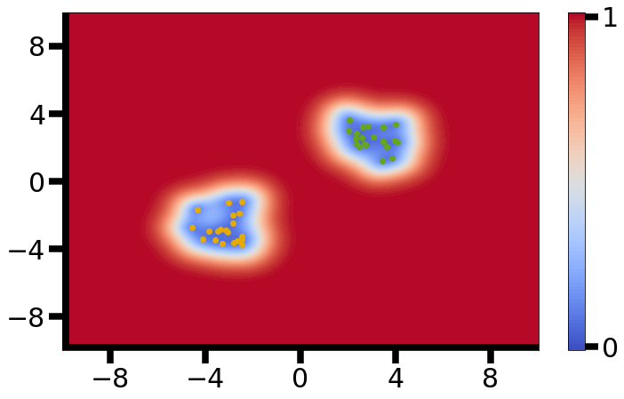
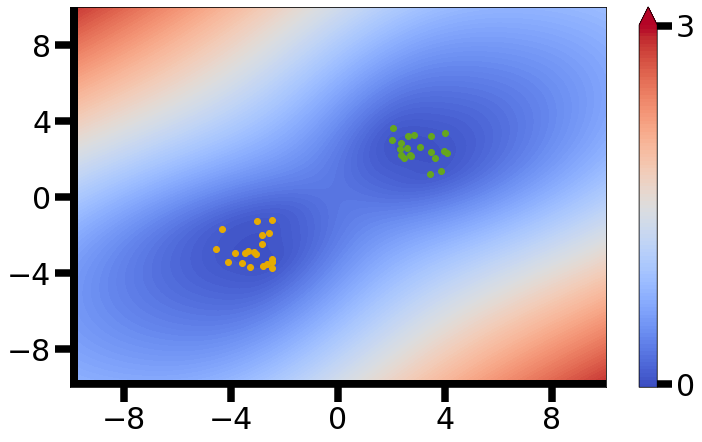

# 从非线性概率模型出发理解BNN

网上许多的关于BNN的介绍都是从DNN出发，认为将权重改为一个随机变量就是BNN了。这种介绍虽然直观，但是无法让人明白BNN的本质，以及所得到的不确定度究竟是什么。因此本篇笔记尝试通过利用更数学的视角，利用核函数、高斯过程等，帮助理解BNN及其相关的不确定度，同时也是对至今为止对于BNN的学习内容总结。

## 非线性概率模型

在现实世界的问题中，输入与输出的关系往往是非线性的。并且由于不确定性的存在，这种因果关系并非确定性因果，而是概率因果，因此我们考虑模型：

$$
{y} = f\left( {{x}} \right)
$$

其中，${x} \in \mathbb R^{in}$是确定的输入向量，$f$是一个非线性概率模型，这意味着模型是非线性的，并且输出向量${ y} \in \mathbb R^{out}$是一个随机矢量。

## 非线性概率模型的神经网络结构

为了简化模型和便于设计和分析，我们设模型可以分为线性部分和非线性部分：

$$
y\left( {\mathbf{x}} \right) = {{\mathbf{w}}^T}\bm\phi \left( {\mathbf{x}} \right)
$$

其中

$\bf x$是输入向量，$\bf w$是$M$维权重向量，并设$\bf w$的先验分布为$p\left( {\bf{w}} \right) = \mathcal N\left( {{\bf{w}}\left| {{\bf{0}},{\alpha ^{ - 1}}{\bf{I}}} \right.} \right)$，$\bm \phi \left( {\bf{x}} \right){\rm{ = }}\left( {{\phi _0}\left( {\bf{x}} \right), \cdots ,{\phi _{M - 1}}\left( {\bf{x}} \right)} \right)^T$。这实际上就是所谓的**广义线性模型**。

> 为了分析方便，以下均假设权重服从高斯分布。但是需要注意，BNN本身并不规定权重一定是高斯先验。已有很多文献说明了选择不同的先验对BNN性能影响很大。

这种表达形式的非线性概率模型就可以用神经网络结构来实现了：具体的来说，权重就是线性部分，激活函数引入非线性，而令权重为一个随机变量则引入概率。

## 神经网络中的核函数

> 本节内容主要来自Bishop的《Pattern Recognition and Machine Learning》6.4.1节。

观察到训练点${\bf x}_1,\cdots,{\bf x}_N$，我们想知道模型输出$y_n=y\left({\bf x}_n\right),n=1,\cdots,N$的联合分布。从模型可以知道

$$
{\mathbf{y}} = {\mathbf{\Phi w}}
$$

其中$\bf \Phi$的元素$\Phi_{nk}=\phi_k\left({\bf x}_n\right)$。由于权重是高斯的，显然输出的联合分布也是高斯的，其均值和协方差为

$$
\mathbb E\left[ {\mathbf{y}} \right] = {\mathbf{\Phi }}\mathbb E\left[ {\mathbf{w}} \right] = {\mathbf{0}}
$$

$$
{{\rm cov}} \left[ {\mathbf{y}} \right] = E\left[ {{\mathbf{y}}{{\mathbf{y}}^T}} \right] = {\mathbf{\Phi }}E\left[ {{\mathbf{w}}{{\mathbf{w}}^T}} \right]{{\mathbf{\Phi }}^T} = {\alpha ^{ - 1}}{\mathbf{\Phi }}{{\mathbf{\Phi }}^T=\mathbf K}
$$

$\bf K$是Gram矩阵，其元素$K_{nm}=k\left({\bf x}_n,{\bf x}_m\right)=\alpha^{-1}{\bm \phi\left({\bf x}_n\right)}^T \bm\phi\left({\bf x}_m\right)$，$k$是核函数。从$\rm cov\left[\bf y\right]$的计算式可以看出核函数满足

$$
k\left( {{{\mathbf{x}}_n},{{\mathbf{x}}_m}} \right) = E\left[ {y\left( {{{\mathbf{x}}_n}} \right)y\left( {{{\mathbf{x}}_m}} \right)} \right]
$$

因此我们可以直接定义核函数来得到输出协方差阵的形式，而不用选择具体的基函数。

> 关于核方法的更多基础，可以参考笔记《再生核希尔伯特空间和核方法》。其中对于核，最重要的一点理解是：核实际上就是在特征空间中的一种点积，而点积在一定条件下（比如向量被单位后）可以视作一种相似度度量。

## 高斯过程回归

> 本节介绍高斯过程回归。我们将可以看到通过高斯过程得到的预测值，其方差随着核函数的增大而减小。本节内容主要来自Bishop的《Pattern Recognition and Machine Learning》6.4.2节。

我们对线性模型加入噪声来得到目标$t_n$

$$
{t_n} = {y_n} + {\epsilon _n}
$$

假设噪声$\epsilon_n$是高斯的并且独立同分布的，给定$y_n=y\left({\bf x}_n\right),n=1,\cdots,N$，$t_n$的联合概率为

$$
p\left( {{\mathbf{t}}\left| {\mathbf{y}} \right.} \right) = \mathcal N\left( {{\mathbf{t}}\left| {{\mathbf{y}},{\beta ^{ - 1}}{{\mathbf{I}}_n}} \right.} \right)
$$

而$y_n$的联合概率为

$$
p\left( {\mathbf{y}} \right) = \mathcal N\left( {{\mathbf{y}}\left| {{\mathbf{0}},{\mathbf{K}}} \right.} \right)
$$

这里核函数矩阵的定义和上一节相同。那么$t_n$的联合边缘概率分布为

$$
p\left( {\mathbf{t}} \right) = \int {p\left( {{\mathbf{t}}\left| {\mathbf{y}} \right.} \right)p\left( {\mathbf{y}} \right)d{\mathbf{y}} = \mathcal N\left( {{\mathbf{t}}\left| {{\mathbf{0}},{\mathbf{C}}} \right.} \right)}
$$

其中

$$
{\mathbf{C}} = {\mathbf{K}} + {\beta ^{ - 1}}{{\mathbf{I}}_n}
$$

实际上${\bf{t}} = {\bf{y}} + {\bm{\epsilon }}$，$\bf{y}$与${\bm{\epsilon }}$是独立的，因此${\bf{t}}$的协方差为两者的协方差直接相加。

之后我们利用新的观测数据${\bf x}^*=\left({\bf x}_{n+1},\cdots,{\bf x}_{n+m+1}\right)^T$预测${\bf t}^*=\left({\bf t}_{n+1},\cdots,{\bf t}_{n+m+1}\right)^T$，假设新的目标加入后的联合分布依然服从高斯分布：

$$
\left[ {\begin{array}{ccccccccccccccc}{\mathbf{y}}\\{{{\mathbf{y}}^*}}\end{array}} \right] \sim \mathcal N\left( {{\mathbf{0}},\left[ {\begin{array}{ccccccccccccccc}{{\mathbf{C}}\left( {{\mathbf{x}},{\mathbf{x}}} \right)}&{{\mathbf{K}}\left( {{\mathbf{x}},{{\mathbf{x}}^*}} \right)}\\{{\mathbf{K}}\left( {{{\mathbf{x}}^*},{\mathbf{x}}} \right)}&{{\mathbf{C}}\left( {{{\mathbf{x}}^*},{{\mathbf{x}}^*}} \right)}\end{array}} \right]} \right)
$$

> 多维高斯分布的条件概率如下：
>
> 若
>
> $$
> \left[ {\begin{array}{ccccccccccccccc}{\mathbf{x}}\\{\mathbf{y}}\end{array}} \right] \sim {\mathcal N}\left( {\left[ {\begin{array}{ccccccccccccccc}{{{\bm{\mu }}_x}}\\{{{\bm{\mu }}_y}}\end{array}} \right],\left[ {\begin{array}{ccccccccccccccc}{\mathbf{A}}&{\mathbf{C}}\\{{{\mathbf{C}}^T}}&{\mathbf{B}}\end{array}} \right]} \right)
> $$
>
> 则
>
> $$
> {\mathbf{x}}\left| {\mathbf{y}} \sim {\mathcal N}\left( {{{\bm{\mu }}_x} + {\mathbf{C}}{{\mathbf{B}}^{ - 1}}\left( {{\mathbf{y}} - {{\bm{\mu }}_y}} \right),{\mathbf{A}} - {\mathbf{C}}{{\mathbf{B}}^{ - 1}}{{\mathbf{C}}^T}} \right) \right.
> $$

根据多维高斯的条件分布公式，可得

$$
\mathbb E\left[ {{{\mathbf{y}}^*}\left| {\mathbf{y}} \right.} \right] = {\mathbf{K}}\left( {{{\mathbf{x}}^*},{\mathbf{x}}} \right){\mathbf{C}}{\left( {{\mathbf{x}},{\mathbf{x}}} \right)^{ - 1}}{\mathbf{y}}
$$

$$
{\mathbf{C}}\left[ {{{\mathbf{y}}^*}\left| {\mathbf{y}} \right.} \right] = {\mathbf{C}}\left( {{{\mathbf{x}}^*},{{\mathbf{x}}^*}} \right) - {\mathbf{K}}\left( {{{\mathbf{x}}^*},{\mathbf{x}}} \right){\mathbf{C}}{\left( {{\mathbf{x}},{\mathbf{x}}} \right)^{ - 1}}{\mathbf{K}}\left( {{\mathbf{x}},{{\mathbf{x}}^*}} \right)
$$

这就得到了预测值的均值和协方差。

> 从上面的协方差公式，我们可以看出：若$k \left(\bf x,x\right)$为某常数，当$k \left(\bf x,x^*\right)$一项较大时，预测值的方差较小。同时我们又有这样的理解：在一定条件下，核实际上就是在特征空间中的一种相似度度量。由此，我们可以能得到一个最重要的直观理解：**当$k \left(\bf x,x\right)$为某常数时，预测样本与训练样本在特征空间中越相似，预测值的方差（不确定度）越小**。
>
> 但是我们必须记住，只有当$k \left(\bf x,x\right)$为某常数时，上面的理解才合理。在一些核函数中，$k \left(\bf x,x\right)$确实为常数，比如径向基核函数（Radial Basis Function，RBF），其形式为：
>
> $$
> k\left( {{\mathbf{x}},{\mathbf{x}}'} \right) = \exp \left( { - \frac{{\left\| {{\mathbf{x}} - {\mathbf{x}}'} \right\|_2^2}}{{2{\sigma ^2}}}} \right)
> $$
>
> 可见，当核为RBF核时，$k \left(\bf x,x\right)$为常数。但也存在着$k \left(\bf x,x\right)$不为常数的核，这种核在特征空间中不是一种严格的相似性度量，就不能这么直观理解了。

## 高斯过程和单层神经网络

> 本节揭示了单层BNN和高斯过程的关系：无限宽度的单层BNN等价于一个高斯过程。这说明了单层BNN与高斯过程有对应关系（同时也暗示了深度BNN也类似）。本节主要参考《Deep Neural Networks As Gaussian Processes》一文。

在单隐藏层（单层）神经网络中，满足

$$
z_j^1\left( x \right) = b_i^1 + \sum\limits_{j = 1}^{{N_1}} {W_{ij}^1x_j^1\left( x \right)}
$$

$$
x_j^1\left( x \right) = \phi \left( {b_j^0 + \sum\limits_{k = 1}^{{d_i}_n} {W_{jk}^0{x_k}} } \right)
$$

我们假设输入$x$是独立的，而且权重和偏置都是i.i.d的。这样$x_j^1,j=1,\cdots,N_1$是相互独立的，而$z_i^1$是一系列i.i.d项的求和，由中心极限定理，在$N_1\to\infin$时，$z_i^1$将服从高斯分布。

> 中心极限定理：大量相互独立的随机变量的均值经适当标准化后依分布收敛于标准正态分布。经典中心极限定理需要i.i.d条件。而林德伯格－费勒定理是中心极限定理的高级形式，它表明满足一定条件时，独立，但不同分布的随机变量序列的标准化和依然以标准正态分布为极限。详见[https://zh.wikipedia.org/wiki/%E4%B8%AD%E5%BF%83%E6%9E%81%E9%99%90%E5%AE%9A%E7%90%86](https://zh.wikipedia.org/wiki/%E4%B8%AD%E5%BF%83%E6%9E%81%E9%99%90%E5%AE%9A%E7%90%86%E2%80%B8)

相类似地对于$k$个输入数据和相应的输出，从多维中心极限定理可知有限集$\{z_i^1\left(x^{\alpha=1}\right),\cdots,z_i^1\left(x^{\alpha=k}\right)\}$是一个联合多变量高斯分布，**这正是一个高斯过程的定义**。

因此我们可以写$z_i^1\sim\mathcal {GP}\left(\mu^1,K^1\right)$。我们假设偏置和权重都是零均值的，并且方差分别为$\sigma_b^2$和$\sigma_w^2/N_l$，这样我们可知这个GP的均值为零，协方差函数为

$$
{K^1}\left( {x,x'} \right) \equiv \mathbb E\left[ {z_i^1\left( x \right)z_i^1\left( {x'} \right)} \right] = \sigma _b^2 + \sigma _w^2\mathbb E\left[ {x_i^1\left( x \right)x_i^1\left( {x'} \right)} \right] = \sigma _b^2 + \sigma _w^2C\left( {x,x'} \right)
$$

## 高斯过程和深度神经网络

> 本节揭示了深度BNN和高斯过程同样有对应关系。BNN所对应的高斯过程具体形式，除了网络深度以外，仅与BNN的激活函数有关。本节主要参考《Deep Neural Networks As Gaussian Processes》一文。

在深度神经网络中，满足

$$
z_j^l\left( x \right) = b_i^l + \sum\limits_{j = 1}^{{N_l}} {W_{ij}^l x_j^l\left( x \right)}
$$

$$
x_j^l\left( x \right) = \phi \left( z_j^{l-1}\left(x\right) \right)
$$

设$z_i^l\sim\mathcal {GP}\left(0,K^l\right)$，协方差函数为

$$
{K^l}\left( {x,x'} \right) \equiv \mathbb E\left[ {z_i^l\left( x \right)z_i^l\left( {x'} \right)} \right] = \sigma _b^2 + \sigma _w^2{\mathbb E_{z_i^{l - 1} \sim \mathcal {GP}\left( {0,{K^{l - 1}}} \right)}}\left[ {\phi \left( {z_i^{l - 1}\left( x \right)} \right)\phi \left( {z_i^{1 - 1}\left( {x'} \right)} \right)} \right]
$$

上式中的期望项是在GP上计算的，实际上就是在$z_i^{l - 1}\left(x\right)$和$z_i^{l - 1}\left(x'\right)$的二维联合高斯分布上计算，而这个分布是零均值，协方差阵由${K^{l-1}}\left( {x,x'} \right)$、${K^{l-1}}\left( {x,x} \right)$和${K^{l-1}}\left( {x',x'} \right)$这三项控制。因此我们可以将期望项用一个函数来表示：

$$
{\mathbb E_{z_i^{l - 1} \sim \mathcal {GP}\left( {0,{K^{l - 1}}} \right)}}\left[ {\phi \left( {z_i^{l - 1}\left( x \right)} \right)\phi \left( {z_i^{1 - 1}\left( {x'} \right)} \right)} \right]\equiv F_\phi\left({K^{l-1}}\left( {x,x'} \right),{K^{l-1}}\left( {x,x} \right),{K^{l-1}}\left( {x',x'} \right) \right)
$$

并且函数$F_\phi$的具体形式仅和基函数$\phi$有关（由神经网络的激活函数决定）。

从上述分析可知，当固定网络深度，BNN所对应的就高斯过程就仅与激活函数有关。

## RBF-GP和ReLU-BNN仿真结果

> 本节利用《On out-of-distribution detection with Bayesian neural networks》一文的仿真结果，直观地理解不确定度。

我们先对RBF-GP进行分析：对于输入${{{\bm{x}}^*}}$，预测值的方差为

$$
{\sigma ^2}\left( {{\bm f}^*} \right) = c\left( {{\bm x}^*,{\bm x}^*} \right) - \sum\limits_{i = 1}^n {{\beta _i}\left( {{\bm x}^*} \right)k\left( {{\bm x}^*,{\bm x}_i} \right)}
$$

其中

$$
{\beta _i}\left( {{\bm x}^*} \right) = \sum\limits_{j = 1}^n {{\mathbf{C}}\left( {\bm x,\bm x} \right)_{ij}^{ - 1}k\left( {{\bm x}^*,{{\bm x}_j}} \right)}
$$

其中$c\left( {{x^*},{x^*}} \right) = k\left( {{x^*},{x^*}} \right) + \sigma _\varepsilon ^2$，在核方法为RBF时，该项为常数。如果输入${{{\bm{x}}^*}}$与训练数据的距离很远，第二项中$k\left(\bm x^*,\bm x_i\right)$也相应的变小，使得预测方差增大。这种性质保证了GP回归中的不确定度可以很好地检测分布外数据（Out-Of-Distribution）OOD。

图 RBF kernel

我们知道，BNN与高斯过程是有对应关系的。如果我们能够找到RBF-GP的对应BNN（需要确定激活函数和网络深度），那么就能得到完全类似的结果。

下面给出ReLU-BNN的仿真结果：

图 ReLU 无限宽度

从图中可以看出，这种情况下的OOD检测似乎要比RBF核差。从数学上讲，是因为ReLU-BNN对应的核函数并不满足$k \left(\bf x,x\right)$为常数，因此不是特征空间中一种严格的相似性度量。

> 《On out-of-distribution detection with Bayesian neural networks》文中给出了ReLU-BNN对应的核函数的具体关系，其推导可参考《Kernel Methods for Deep Learning》。

## 总结

我们通常将BNN的输出方差作为预测不确定度的度量，而BNN与高斯过程的关系十分紧密。虽然目前缺乏理论研究，还不能确定BNN的网络深度、权重先验、激活函数对于不确定度量化的具体影响，但通过对对应的高斯过程的分析，我们可以理解到核在其中起到的关键作用，并启发式地理解不确定度。

## 附：BNN的训练方法

BNN的三种最常见训练方法为：

1. MCDropout
2. 基于变分推断的BBB（Bayes By Backprop）方法
3. MCMC

其中，MCMC由于训练速度慢，用的较少。

了解具体的训练方法对于理解BNN而言并没有多大帮助。实际上在使用BNN的时候甚至不需要明白如何训练，现已有很多开源代码帮助搭建BNN。因此关于训练BNN的部分，在以理解BNN为目标的本文中不详细说明。

