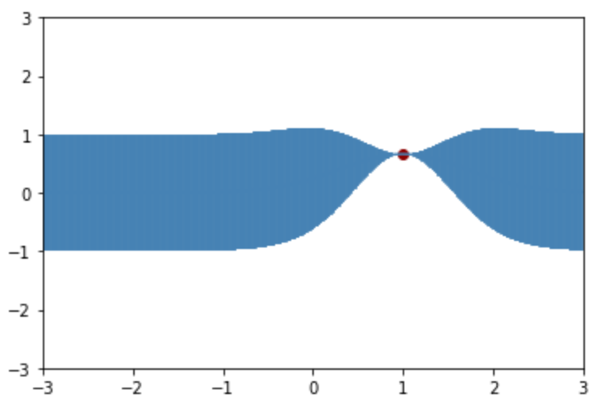
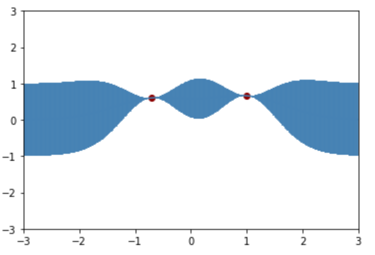

# 高斯过程回归一个简单的实例

## 基本假设和定义

令输入$x \in \mathbb R$和输出$y \in \mathbb R$（为了简单，输入输出都**假设**是标量），**假设**他们满足概率因果关系：

$$
y = w \cdot \phi \left( x \right)
$$

其中$w \sim \mathcal N\left( {0,1} \right)$（实际上对于方差不为1的情况，总能乘一个系数将方差归一化，并可以将这个系数并入$\phi\left(x\right)中$），$\phi$是确定性的非线性函数。**在以上假设下**，$y$也是高斯的（并且是零均值，实际上总有办法将$y$标准化至零均值）。对于输入$x_1,x_2$对应输出$y_1,y_2$的协方差为：

$$
cov\left(y_1,y_2\right)
=\mathbb E\left[ {{y_1}{y_2}} \right] 
={\phi \left( {{x_1}} \right)\phi \left( {{x_2}} \right)}
$$

我们**定义高斯过程的核函数**$k$为：

$$
k\left( {{x_1},{x_2}} \right) \equiv {\phi \left( {{x_1}} \right)\phi \left( {{x_2}} \right)} =
 cov\left(y_1,y_2\right)
$$

> 注：只要一个二元函数是正定的、对称的，就可以被定义为一个核函数。协方差显然是正定对称的，因此上面对高斯过程的核函数的定义是合理的。

> 从上述定义可以看出，对于高斯过程，我们只要定义了核函数，实际上就隐含地建立了模型$y = w \cdot \phi \left( x \right)$。这与神经网络是截然不同的：神经网络需要确定网络结构，然后参数化地表示出模型。而高斯过程则不需要这种结构和参数，所以高斯过程被认为是一种**非参数化方法**。

**假设**观测带有加性高斯噪声：
$$
{t} = {y} + {\epsilon}
$$

其中$\epsilon \sim \mathcal N \left(0,\beta^{-1} \right)$，并且$\epsilon $与$y$是**独立的**。

为了之后的表达方便，先**定义**一个函数$C$：

$$
C\left( {{x_n},{x_m}} \right) = k\left( {{x_n},{x_m}} \right) + {\beta ^{ - 1}}{\delta _{nm}}
$$

其中
$$
{\delta _{nm}} = \left\{ {\begin{array}{ccccccccccccccc}{1,n = m}\\{0,n \ne m}\end{array}} \right.
$$
$n$个训练数据$\bm x = [x_1,\cdots,x_n]$对应的观测值$\bm t = [t_1,\cdots,t_n]$的分布为：
$$
p\left(\bm t \right)\sim \mathcal N\left( {0,\mathbf C} \right)
$$

其中$\mathbf C$的第$n$行第$m$列元素为$C\left(x_n,x_m\right)$。

> 注意此处的$C\left( {{x_n},{x_m}} \right)=cov\left(y_n,y_m\right)+\beta^{-1}\delta_{nm}$不是计算$x_n$和$x_m$之间的协方差（实际上$x_n$和$x_m$不是随机变量，算协方差没有意义），而是**观测的协方差**，容易混淆。

> 在$y$和噪声$\epsilon$均为高斯的假设下，观测值服从多维高斯分布，这是高斯过程之所以被称为高斯过程的直接原因。需要注意的是，$y$和噪声$\epsilon$必须均为高斯。只要其中一个不是高斯的，那么$p\left(\bm t \right)$就不为高斯。

## 利用高斯过程进行预测

给定训练集$\bm x = [x_1,\cdots,x_n]$和对应的标签（观测）$\bm t = [t_1,\cdots,t_n]$。现在，对于**一个**输入数据$x_{n+1}$（简单起见，就预测一个），我们想要预测其对应的标签$t_{n+1}$。根据高斯过程的基本假设，在加入$t_{n+1}$后， ${\bm t}^{new}=[t_1,\cdots,t_n,t_{n+1}]$也服从多维高斯分布：

$$
p\left( {{{\bm t}^{new}}} \right)\sim {\mathcal N}\left( {0,{{\mathbf C}^{new}}} \right)
$$

容易看出$\mathbf C_{new}$左上角的$n\times n$方阵就是$\bm t$的协方差阵$\mathbf C$，因此可以写出

$$
{{\mathbf C}^{new}} = \left( {\begin{array}{ccccccccccccccc}{\mathbf C}&{\bm k}\\{{{\bm k}^T}}&c\end{array}} \right)
$$

其中$\bm k$是$n$维列向量$[k(x_1,x_{n+1}),\cdots,k(x_n,x_{n+1}))]^T$，$c=C\left(x_{n+1},x_{n+1}\right)=k\left(x_{n+1},x_{n+1}\right)+\beta^{-1}$。

我们要求的分布实际上是条件分布$p\left( {t_{n+1}}|\bm t\right)$，该条件分布也是高斯分布。由多维高斯条件分布的公式就可以直接得到：

$$
m\left( {{t_{n + 1}}}|\bm t \right) = {{\bm k}^T}{\mathbf C^{ - 1}}\bm t
$$

$$
{\sigma ^2}\left( {{t_{n + 1}}}|\bm t \right) = c - {{\bm k}^T}{{\mathbf C}^{ - 1}}\bm k
$$

如此，我们就预测了$p\left( {t_{n+1}}|\bm t\right)\sim \mathcal N \left(m {\left( {t_{n+1}}|\bm t \right)},\sigma^2 {\left( {t_{n+1}}|\bm t \right)}\right)$。

## 简单的仿真例子

> 本部分的colab代码网址为[https://colab.research.google.com/github/kastnerkyle/kastnerkyle.github.io/blob/master/posts/introduction-to-gaussian-processes/introduction-to-gaussian-processes.ipynb](https://colab.research.google.com/github/kastnerkyle/kastnerkyle.github.io/blob/master/posts/introduction-to-gaussian-processes/introduction-to-gaussian-processes.ipynb)
>
> 这个代码可以通过网页打开，直接运行。

考虑先验噪声方差$\beta^{-1}=1$，核函数为

$$
k\left( {{x_1},{x_2}} \right) = {{{\rm e}} ^{ - {{\left( {{x_1} - {x_2}} \right)}^2}}}
$$

只有一个训练点，拟合的结果：

（图中蓝色范围即**预测均值±标准差**，蓝色范围越大代表方差越大）

可见，训练点附近的预测方差小，距离训练点越远，均值趋近于0，并且方差趋近于先验噪声方差 $\beta^{-1}$。

再加入一个训练点：
