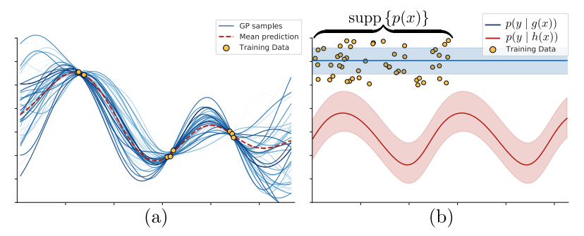

# On out-of-distribution detection with Bayesian neural networks

对于一个神经网络，某个输入对于该模型试图解决的问题来说是否是有效的？这个问题引起了人们对于分布外（out-of-distribution，OOD）检测的关注。简单地说，OOD检测就是检测新数据是否与训练数据一致。人们常常认为BNN很适合这个任务，因为BNN天然地可以度量认知不确定度。这篇文章对这个假说提出质疑，并且用结果说明了利用神经网络诱导的函数空间先验进行适当的贝叶斯推理并不一定能得到良好的OOD检测。

## Introduction

近期的AI发展预示着会有越来越多的机器学习算法应用于工业界，使用不确定度来进行OOD检测的理论基础显得越发重要。

本文考虑OOD点为不太可能在数据分布$p\left( x \right)$下的点，并只关注利用BNN的预测不确定性进行OOD检测的合理性问题。

过参数化模型进一步拓展了潜在解空间（hypothesis class），欺骗性地使人们产生了这么一种想法：在贝叶斯框架下的认知不确定性可能本质上适合于检测不熟悉的输入。

当$p\left( {w\left| D \right.} \right)$表示的模型对在分布内的样本能拟合，但对OOD样本不拟合时，从直觉上来说上面的想法是对的。但是，由贝叶斯推理引起的不确定性一般并不会产生OOD能力，这将在后面用例子解释。

## On the difficulty of defining out-of-distribution inputs

OOD点在数学上很难定义，OOD检测的方法常常基于直觉设计。用不确定性来判断OOD也是一种直觉，因为在目标函数的设计上并没有控制OOD不确定度，除非对OOD数据进行了明确的训练。

## Background

这部分介绍相关基础概念。然后，讨论了在没有参数限制和选择某种先验的情况下，BNN将收敛到高斯过程。高斯过程是另一种能够进行精确推断的贝叶斯推断架构。根据BNN和高斯过程之间的关系，我们可以对OOD的行为作出有趣的猜想。

### Bayesian neural networks

略。

### Gaussian process

> 定义：高斯过程（Gaussian Process，GP）是一个随机变量的集合。任意有限个GP都有一个联合高斯分布。一个GP可以通过均值和协方差定义。协方差可以用核函数$k：\mathbb R^d \times \mathbb R^d \rightarrow \mathbb R$来指定。例如：
>
> $$
> p\left( {\bm f\left| X \right.} \right) = \mathcal N\left( {{\bf 0},K\left( {X,X} \right)} \right)
> $$
>
> 其中$K\left( {X,X} \right)_{ij} = k\left(\bm x_i, \bm x_j \right)$，$\bm f_i = f\left(\bm x_i\right)$。当观察到训练数据，就将先验修正为最有可能生成这些训练数据的分布。
>
> 关于GP的详细内容可参考[高斯过程.md](../Math/高斯过程.md)

GP常用的核函数是平方指数的RBF：

$$
k\left( {\bm x,\bm x'} \right) = \exp \left( { - \frac{1}{{2{l^2}}}\left\| {\bm x - \bm x'} \right\|_2^2} \right)
$$

#### The relation of infinite-width BNNs and GPs

在无限宽度的深度BNN（或被称作neural network Gaussian processes，NNGP）中，在选择合适先验的情况下，激活函数决定了BNN能够收敛到何种核函数的GP。文中举了一些不同激活函数导出的不同核函数的例子。

### The architecture strongly influences OOD uncertainties

本节讨论在传统核函数和NNGP导出的核函数下的OOD行为。

#### Uncertainty quantification for OOD detection

不确定性有许多量化方法，最常见的是用熵来量化。

> 在一些常见的分布下，用熵或方差量化不确定性是等价的。但是当分布有“多峰”（非凸）时，方差描述不确定度的能力降低，这时用熵更合适。
>
> 可参考[https://www.zhihu.com/question/361641064](https://www.zhihu.com/question/361641064%E2%80%B8)

预测的后验同时包含了随机不确定性和认知不确定性两方面信息，这使得区分不了OOD和输入本身的随机不确定性。然而OOD检测应该仅仅基于认知不确定性。由于没有更好的得到认知不确定度的手段，文章中将输出方差视作认知不确定度。

#### Bayesian statistics and OOD detection have no intrinsic connection

预测不确定度并不必然反映数据分布，也因此并不就一定适合于OOD检测。

> 文章举了下面两幅图作为例子：左图是RBF核的GP回归，右图是一种极端情况的例子（潜在解空间的仅包含$g\left(x\right)$和 $h\left(x\right)$)。左图说明了GP回归中训练点附近的不确定度（以方差评估）很小，而在OOD区域中不确定度很高。右图说明了，当观察到训练数据后通过贝叶斯推断就会得到模型$g\left(x\right)$，而在该模型中不确定度在分布内外没有区别，这种情况说明了贝叶斯推断并不必然能得到可以很好地检测OOD的不确定度。并且检测OOD的能力与是否拟合训练集也无关。

#### GP regression with an RBF kernel

由GP回归的推导可知，对于输入${{{\bm{x}}^*}}$，预测值的方差为

$$
{\sigma ^2}\left( {{\bm f}^*} \right) = c\left( {{\bm x}^*,{\bm x}^*} \right) - \sum\limits_{i = 1}^n {{\beta _i}\left( {{\bm x}^*} \right)k\left( {{\bm x}^*,{\bm x}_i} \right)}
$$

其中

$$
{\beta _i}\left( {{\bm x}^*} \right) = \sum\limits_{j = 1}^n {{\bf{C}}\left( {\bm x,\bm x} \right)_{ij}^{ - 1}k\left( {{\bm x}^*,{{\bm x}_j}} \right)}
$$

可见，如果输入${{{\bm{x}}^*}}$与训练数据的距离很远，核函数也相应的变小，使得预测方差增大。这种性质保证了GP回归中的不确定度可以很好地检测OOD。

#### The OOD behavior induced by NNGP kernels
