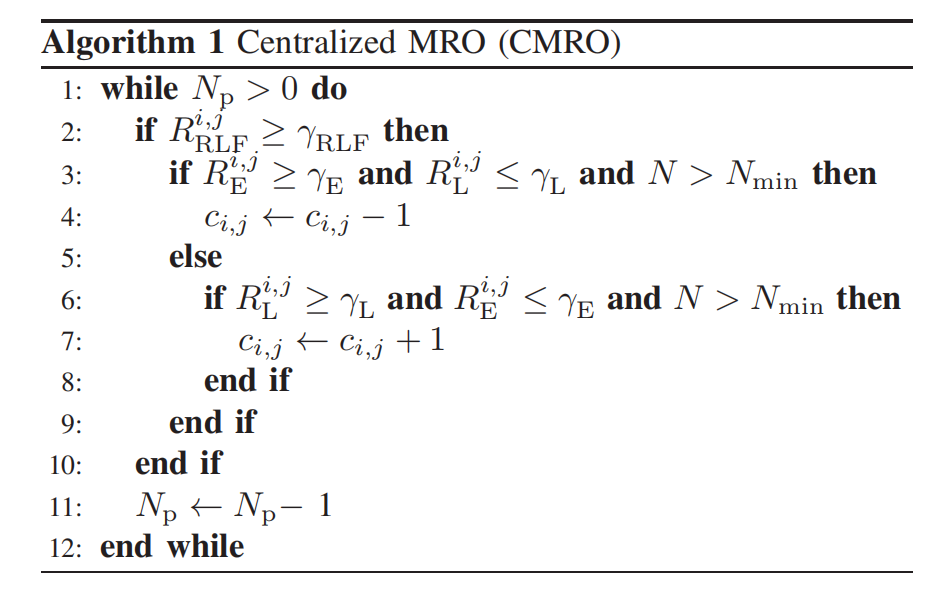

# Big Data Enabled Mobility Robustness Optimization for Commercial LTE Networks

## Big Data Enabled MRO Algorithm

文章首先调研了现实LTE场景下的HO数据，发现大部分过早切换都是发生在同频切换中，并且问题经常发生在特定的几对小区（cell-pairs）中，因此文章选择CIO作为优化变量。

算法思路：当大数据显示当前小区对过早切换的频率高于阈值，就减小CIO；若过晚切换的频率高于阈值，就增加CIO。

## Results and Discussion

在实际场景中部署算法，在几天后发现过早切换和过晚切换率都明显下降。文章中讨论了几点：

- 观察时间

    为了在实际移动网络中全面评估算法的效果，需要足够长的观察时间。

- 过早切换和过晚切换的优化折中

    文章发现，针对过早切换优化将导致过晚切换率提高，反之亦如此。

- 乒乓效应
  该算法提高HO成功数量的同时也增加了乒乓效应，尤其是针对过晚切换的优化，会极大提高乒乓效应的数量。虽然在网络中乒乓效应不作为RLF，但是会增加网络资源的损耗。
