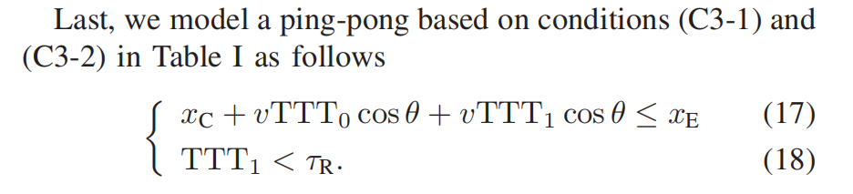

# Geometry-Based Analysis of Optimal Handover Parameters for Self-Organizing Networks

## System Model

- 无线链路的质量测量
  文章用SINR来判断RLF，SINR被估计为

  $$
  \gamma  = \frac{{{m_0}}}{{\sum\nolimits_{i \ne 0} {{m_i}}  + {N_0}}}
  $$

  其中$m_0$和$m_i$是服务小区Cell 0 和邻接小区Cell i 的接收RSRP，$N_0$是噪声。
- 切换过程和控制参数
  A3事件的进入条件为：

  $$
  {M_j} + {\Delta _{ij}} > {M_i}
  $$

  其中$M_i$和$M_j$是分贝为尺度的RSRP测量，$\Delta_{ij}$是由Cell i向Cell j的切换裕度。
- 切换失败和乒乓效应

  RLF和乒乓效应是我们不希望切换遇到的事。乒乓效应包括了一连串成功的HO，而RLF则是基于三种原因导致的切换失败：过晚、过早或是接入错误小区。

文中通过示意图总结了过晚、过早和乒乓效应发生的情形，并总结了三者的地理位置条件和时间条件。

## Analysis of Undesirable Handovers

### User Mobility and Positions of Event Triggers

文中先从两个基站开始考虑：

然后列出了图中几个点的坐标方程：

### Modeling Undesirable Handovers

文章对过晚、过早和乒乓效应的发生情况建模为：

### Optimal Range for Handover Offset

文中将不会发生过晚切换的最小$\Delta _{01}$记为$\Delta _{01}^\dag$，不会发生过早和乒乓切换的最大$\Delta _{01}$记为$\Delta _{01}^*$。若$\Delta _{01}^\dag < \Delta _{01}^*$，则最优域$[\Delta _{01}^\dag, \Delta _{01}^*]$存在。

并且文中给出了条件：

此外有两个结论：

- 最优条件满足时，当UE速度增加，最优域会拓宽；当UE速度减少，最优域会缩短。
- 最优条件满足时，当TTT减小时，最优域会向左移；当TTT增大时，最优域会向右移。

### Discussion of the Optimal Range of Handover Offset

由于式（8）、（11）、（12）和（13）的非线性，$[\Delta _{01}^\dag, \Delta _{01}^*]$的显式解难以获得。因此我们很难获得关于HO参数和HOF的相关推论。但当UE从Cell 0笔直走向Cell 1时，我们可以求出$[\Delta _{01}^\dag, \Delta _{01}^*]$的显式解。