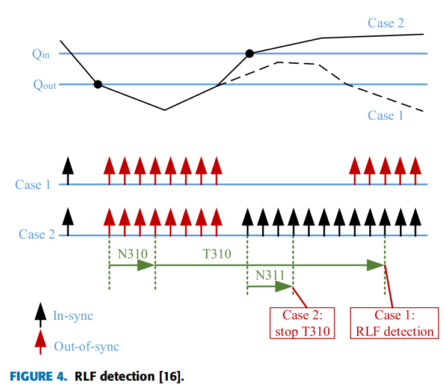

# 仿真中HOF的判定

## 仿真中判定HOF的情况

仿真中判定HOF主要有以下四种条件：

|                          HOF判定条件                          |                   可能导致的实际问题                   |
| :------------------------------------------------------------: | :----------------------------------------------------: |
|                 T310持续时间内UE接收到了HO_CMD                 |       由于信道状况差，HO_CMD信令传输失败导致HOF       |
|                触发A3后、接收HO_CMD前发生了RLF                |                     由于RLF导致HOF                     |
| 在UE接收到HO_CMD后、切换执行完成之前T-BS的平均信道质量低于Qout |          在T-BS端发生DL PDCCH failure导致HOF          |
|       成功切换后又迅速切换到其他BS，在T-BS的ToS低于阈值       | 乒乓效应（$A\to B\to A$）切换错误（$A\to B\to C$） |

## RLF的定义

RLF可以通过RSRP或SINR来检测。以RSRP为例：如果RSRP高于阈值Qin，那么就记一次In-sync，如果RSRP低于Qout，就记一次Out-of-sync。当连续发生数次Out-of-sync时，事件N310触发，一个计时器T310开始计时。如果在T310的计时时间内，连续发生数次In-sync，那么事件N311触发，T310计时停止，不发生RLF。如果T310计时时间内没有N311触发，那么到达T310的最大持续时间后，发生RLF，断开与当前S-BS的连接。

严格来说，Qin和Qout的值是要根据2%和10%的BLER来确定的。
