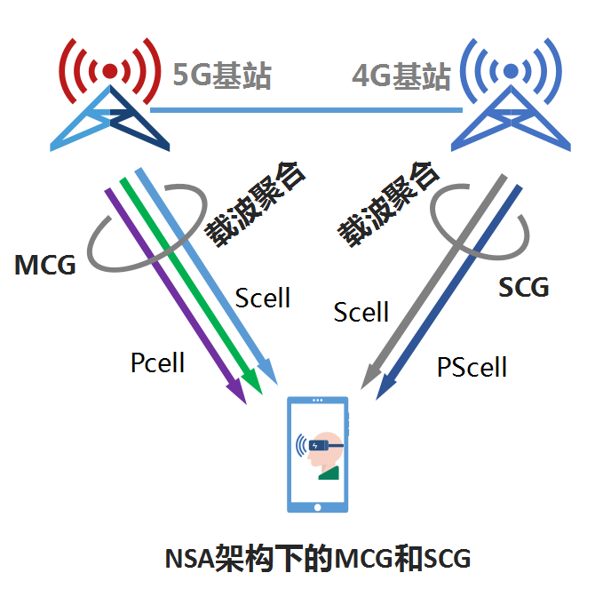

# 4G LTE/5G NR相关基础概念

1. FR：Frequency Range。3GPP为5G定义了两个FR：
   - FR1：450MHz~6000MHz
   - FR2：24250MHz~52600MHz
     4G LTE只能使用FR1。
2. OFDM参数集：OFDM Numerology（也即Configuration）
   - 子载波间隔SCS：SubcarrierSpace，通常使用序号$\mu\in\{0,1,2,3,4\}$来表示5G NR中的5种不同SCS，对应的$\Delta f$分别为15kHz，30kHz，60kHz，120kHz和240kHz。而4G LTE则仅支持15kHz。
   - 5G NR对所有SCS都支持普通循环前缀，但仅对$\mu=2$（即$\Delta f=60kHz$）支持拓展循环前缀。SCS从15kHz到120kHz适用于共享信道，而240kHz用于同步信号。具体的SCS取值还与具体的频段有关，比如对于28GHz和39GHz毫米波频段，可用的SCS为60kHz和120kHz。
3. 有用符号时间（长度）：OFDM的符号时间长度$T_u$与SCS呈反比：$T_u=1/\Delta f$。由于5G NR有5中不同的SCS，因此有对应的5种符号时间：$T_u,0.5T_u,0.25T_u,0.125T_u,0.0625T_u$，其中$T_u=66.67\mu s$。
4. 帧：frame，4G LTE和5G NR都规定了一帧为10ms，每一帧都被划分为了长度为1ms的子帧（subframe）。
5. 时隙：slot，在5G NR中被视作可调度的最小单元。在4G LTE系统中1个子帧被固定划分为了2个0.5ms的时隙。在5G NR中时隙大小是根据$T_u$决定的：使用普通循环前缀时，一个时隙有14个OFDM符号，使用拓展循环前缀时则有12个PFDM符号。
6. RE：Resource Element，频域1个子载波，时域1个符号。
7. RB：Resource Block，5G NR仅规定一个RB包含12个子载波（根据numerology不同，RB的带宽也不同），对RB的时间长度并没有定义。4G LTE不仅规定了一个RB包含12个子载波（12x15=180kHz），还规定了时间长度为7个普通循环前缀OFDM符号或6个拓展循环前缀OFDM符号。
8. MCS：Modulation and Coding Scheme，5G NR中通常使用序号0~31表示32种不同方式。MCS决定了一个符号能够传输的比特数和传输码率，其中传输码率（code rate）是指有用比特数与总比特数的比值。通常MCS的选择与信道质量（一般用SINR评估）紧密联系，但具体的MCS选择要通过一系列复杂的算法完成。
9. 载波聚合：Carrier Aggregation，CA。参与CA的每一个载波都可以叫做分量载波（component carrier，CC）。参与聚合的载波不限于同一基站，也可以来自相邻基站。CA可以分为三类：
   - 频段内连续的CA
   - 频段内不连续的CA
   - 频段间的CA
10. Pcell、Scell：，主小区（primary cell，Pcell）和辅小区（secondary cell，Scell）。Pcell承载信令，管理其他小区。Scell用于扩展带宽，由Pcell决定何时增加和删除。
11. 双连接：dual connectivity，DC。指5G在非独立组网（NSA）下，设备可以同时连接到4G基站和5G基站的技术。
12. MCG、SCG：master cell group（主小区组），secondary cell group（辅小区组）。在双连接下才会有MCG和SCG的概念，将4G和5G基站分为主辅。
13. PScell：primary secondary cell,即SCG中的Pcell。
14. Spcell：Pcell+PScell，即指代MCG和SCG中的Pcell。
    
15. AMF：Access & Mobility Management Function，接入和移动管理功能。AMF是5G核心网中的控制面功能，它的主要功能和职责为：

- 注册管理：UE必须完成注册流程来获得使用5G服务的许可。AMF允许UE注册和取消注册。
- 连接管理：建立和发布UE和AMF之间的控制面信令连接。
- 可达性（reachability）管理：保证UE是可达的，即当需要建立移动终端连接时，能够呼叫到UE。
- 移动性管理：持续获取对UE在网络内的位置信息。

16. UPF：User Plane Function，用户面功能。其主要功能为：

* 无线接入网络与数据网络（DN，Data Network）之间的互联点，用于用户面的GTP隧道协议（GTP-U，GPRS Tunneling Protocol for User Plane）的封装和解封装；
* 协议数据单元会话锚点（PSA，PDU Session Anchor），用于在无线接入时的提供移动性；
* 5G SA数据包的路由和本地分流，作为中继UPF（I-UPF，Intermediate UPF）充当上行分类器（UL-CL，Uplink Classifier）或者分支节点UPF（Branching Point UPF）。

  除上述功能外，UPF还有应用程序监测、数据流QoS处理、流量使用情况报告、IP管理、移动性适配、策略控制和计费等功能，可参考3GPP TS 23.501规范。

17. SMF：Session Management Function，会话管理功能。SMF主要负责与分离的数据面交互，创建、更新和删除PDU会话，并管理与UPF的会话环境（session context）。
