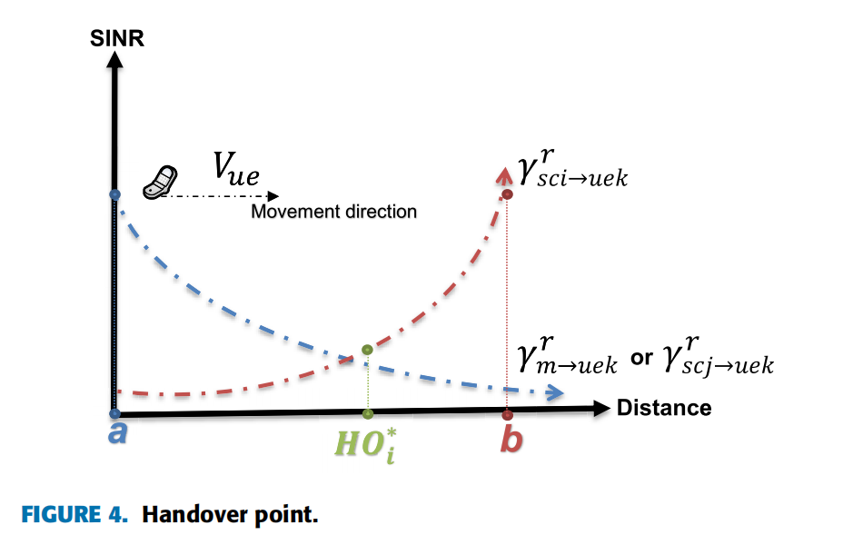

# Load Dependent Handover Margin for Throughput Enhancement and Load Balancing in HetNets

## Network System Model

考虑如下异构网：一个宏基站覆盖的宏小区（MC）带有3个扇区（每个120°），扇区内均匀分布着微基站形成的微小区（SC）。宏基站与微基站的最小距离限制为75m，宏基站与UE的最小距离限制为35m。

从MC到UE的接收SINR为

$$
\gamma _{m \to u{e_k}}^r = \frac{{P_{m \to u{e_k}}^r}}{{\sum\nolimits_{j = 1}^{{N_{sc}}} {P_{s{c_j} \to u{e_k}}^r}  + {\sigma ^2}}}
$$

同理，从SC到UE的接收SINR为

$$
\gamma _{s{c_i} \to u{e_k}}^r = \frac{{P_{s{c_i} \to u{e_k}}^r}}{{P_{m \to u{e_k}}^r + \sum\nolimits_{j = 1,j \ne i}^{{N_{sc}}} {P_{s{c_j} \to u{e_k}}^r}  + {\sigma ^2}}}
$$

在MC的第$i$个扇区，其负载$L_{m_i}$为

$$
{L_{{m_i}}} = \frac{{RB_{{m_i}}^{ue}}}{{R{B_{tm}}}}
$$

其中$RB_{m_i}^{ue}$是该扇区中所有UE占用的PRB数，$RB_{tm}$是MC的PRB总数。

同理，第$j$个SC的负载$L_{sc_j}$为

$$
{L_{S{C_j}}} = \frac{{RB_{s{c_j}}^{ue}}}{{R{B_{ts{c_j}}}}}
$$

文章提出的方法中，切换点不再依靠接收信号的功率强度决定，而是依靠SINR决定：

## Proposed Method Process

下面介绍文章所提出的具体算法流程：

首先，建立邻小区列表

$$
N_{sc}^* = \left\{ {s{c_i} \in {N_{sc}}\left| {\gamma _{s{c_i} \to u{e_k}}^r} \right. > {\gamma _{th}}} \right\}
$$

其中，$N_{sc}$为所有SC组成的列表。列表$N_{sc}^*$剔除了SINR低于阈值$\gamma_{th}$的SC。

然后，进一步建立列表

$$
N_{sc}^{**} = \left\{ {s{c_i} \in N_{sc}^*\left| {\mathbb E\left[ {To{S_{ue \to {\rm{s}}{{\rm{c}}_i}}}} \right] > {T_{th}}} \right.} \right\}
$$

其中，$ToS_{ue\to sc_i}$表示UE在$SC_i$中的停留时间。列表$N_{sc}^{**}$进一步剔除了期望停留时间低于阈值$T_{th}$的SC。

为了降低SINR的计算复杂度，文章仅计算$N_{sc}^{**}$中的干扰：

$$
\gamma _{s{c_i} \to u{e_k}}^{r_{eq}} = \frac{{P_{s{c_i} \to u{e_k}}^r}}{{P_{m \to u{e_k}}^r + \sum\nolimits_{j = 1,j \ne i}^{{N_{sc}^{**}}} {P_{s{c_j} \to u{e_k}}^r}  + {\sigma ^2}}}
$$

以MC到SC的HO为例，利用SINR进行HO判断的条件为

$$
\gamma _{s{c_i} \to u{e_k}}^r \ge \gamma _{m \to u{e_k}}^r - \gamma _{m \to s{c_i}}^{pro}
$$

其中$\gamma _{m \to s{c_i}}^{pro}$为文章提出的滞后参数（类似于HOM）。该项的计算式为

$$
\gamma _{m \to s{c_i}}^{pro} = {L_{{m_i}}} \cdot {\gamma _{m \to s{c_i}}}
$$

其中$\gamma _{m \to s{c_i}}$(和$\gamma _{s{c_j} \to s{c_i}}$)与UE速度有关，文章将其调整为：

$$
{\gamma _{m \to s{c_i}}} = \left\{ {\begin{array}{ccccccccccccccc}{4dB,{V_{ue}} \le 20km/h}\\{3dB,20km/h < {V_{ue}} \le 50km/h}\\{2dB,{V_{ue}} > 50km/h}\end{array}} \right.
$$

可见，MC的负载越大，滞后参数$\gamma _{m \to s{c_i}}^{pro}$越大，HO的条件越容易满足，即倾向于让MC内的UE切换出去。
