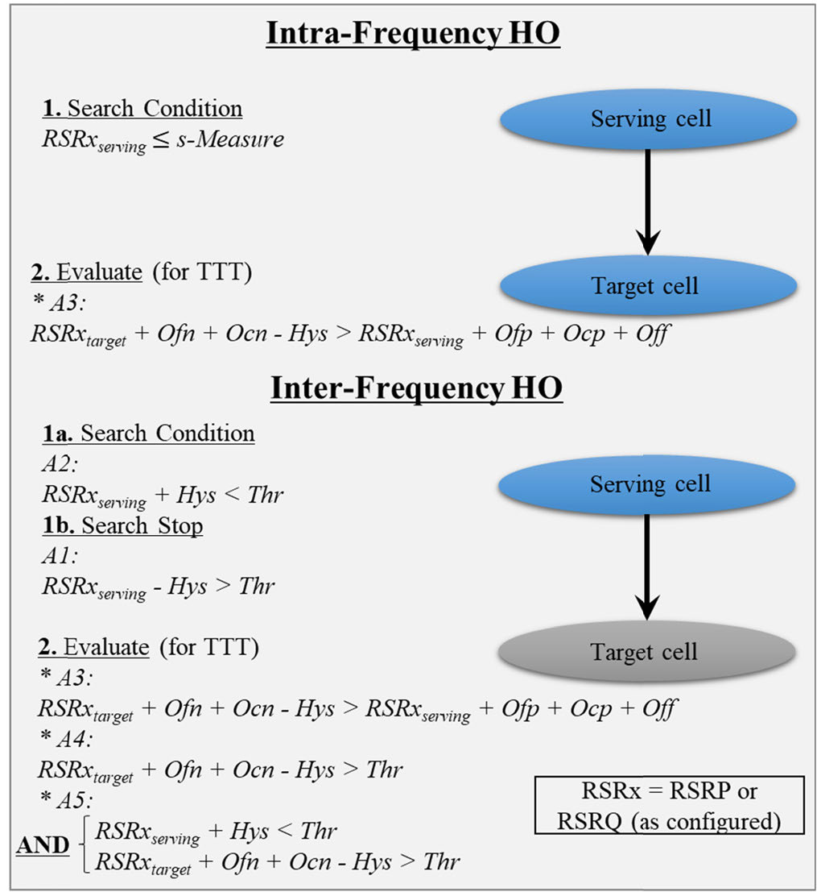

# Mobility Management in Emerging Ultra-Dense Cellular Networks: A Survey, Outlook, and Future Research Directions

## Understanding Mobility in Cellular Networks

在5G中，移动性被划分为空闲模式和连接模式。移动性过程（mobility procedure）通过事件A1，A2，A3，A4，A5，A6来触发HO。

| 事件 |                     触发条件                     |          用途/行为          |
| :--: | :----------------------------------------------: | :--------------------------: |
|  A1  |                UE的RF状态高于阈值                | 关闭测量，停止频间查询邻小区 |
|  A2  |                UE的RF状态低于阈值                | 开启测量，开始频间查询邻小区 |
|  A3  |     邻小区RF状态比SpCell的RF状态高出设定阈值     |          触发频内HO          |
|  A4  |              邻小区的RF状态高于阈值              | 用于频间HO管理（如负载均衡） |
|  A5  | SpCell的RF状态低于阈值并且邻小区的RF状态高于阈值 | 用于频间HO管理（如负载均衡） |
|  A6  |     邻小区RF状态比SCell的RF状态高出设定阈值     |      触发SCell的频内HO      |

## Connected Mode Mobility

当UE在服务BS与无线电资源控制（Radio Resource Control，RRC）层建立连接，并且网络可以给UE传输信息或者接受信息，那么UE就处于连接模式。当UE从一个BS移动到另一个BS，就需要HO。

### UE Side Mobility Trigger

UE通过给它的服务小区发送A3-测量报告（Measurement Report，MR）来触发对下一个最优小区的频内HO请求。服务小区通过和目标小区和服务AMF通信来决定是否接受HO请求和执行HO。

其中的参数定义如下：

在蜂窝网络中，频内HO通常是首选。但也有一些情况频间HO的优先级更高，比如：

- 服务频段正好覆盖不到UE的位置
- 当前服务小区不支持所要求的服务
- 需要负载均衡来避免服务频段过于拥挤

### Network Side Mobility Trigger

除了服务小区和目标小区，在HO过程中核心网实体（包括AMF，SMF和UPF）也需要实时更新。当AMF，SMF和UPF在HO的过程中没有变化，信令是合理的时候，这种HO被称为基于Xn的HO（Xn based HO）。当切换的两个小区之间没有Xn端口时，就需要执行基于N2的HO（N2 based HO），N2 based HO的通信路径更长。

### Common Connected Mode Mobility Risks

除了物理层中由于多普勒频移造成的快衰落影响，移动UE还需要解决一些Layer 3（信令层）问题。

一些问题的解决方案如下：
