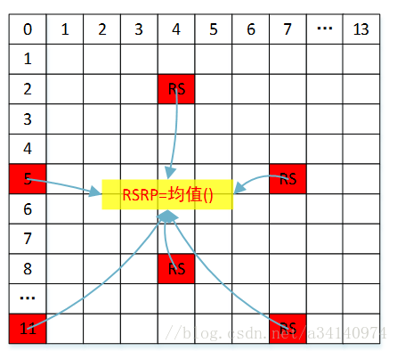

# RSRP、RSSI、RSRQ和SINR

## RSRP

RSRP，Reference Singal Receiving Power，是指定测量频带上，承载小区专属参考信号（RS）的资源粒子（RE）的功率贡献（单位瓦特）的线性平均值（协议规定RSRP指的是每RE的能量，但每个RE中都安插RS不可实现。因此，只能算在RB中安插几个之后算均值），如下图所示。简单的可以认为RSRP就是每个subcarrier的功率。

RSRP的参考点在UE的天线端。

如果UE有多根天线（接收分集），RSRP的报告值不应低于任何一个天线端的测量值。通常，在第一个天线端口的RS被用于决定RSRP。如果UE能在第二个天线端口检测到RS，那么第二个天线端口的RS也可以用于决定RSRP。

- 注意RSRP是RE的平均接收功率，而不是RE的接收功率之和。

## RSSI

假设测量的带宽上有$nRB$个RB。Received Signal Strength Indicator，RSSI被定义为：

$$
RSSI = {S_{tot}} + {I_{tot}} + {N_{tot}}
$$

其中下标$tot$表示是在$N\times12$个RE（也即子载波）上的总测量功率。

$$
{S_{tot}} = nTx \cdot \overline {nRE}  \cdot nRB \cdot RSRP
$$

其中$nTx$表示基站的发射天线数，$\overline {nRE}$表示每个RB上传输信号RE的平均个数（$\overline {nRE} < 12$）。干扰和噪声功率为：

$$
{I_{tot}} + {N_{tot}} = 12 \cdot nRB \cdot \left( {I + N} \right)
$$

其中$I$和$N$表示每个RE上的平均干扰和噪声功率。

## RSRQ

Reference Signal Received Quality，RSRQ被定义为

$$
RSRQ = nRB \cdot \frac{{RSRP}}{{RSSI}}
$$

## SINR
